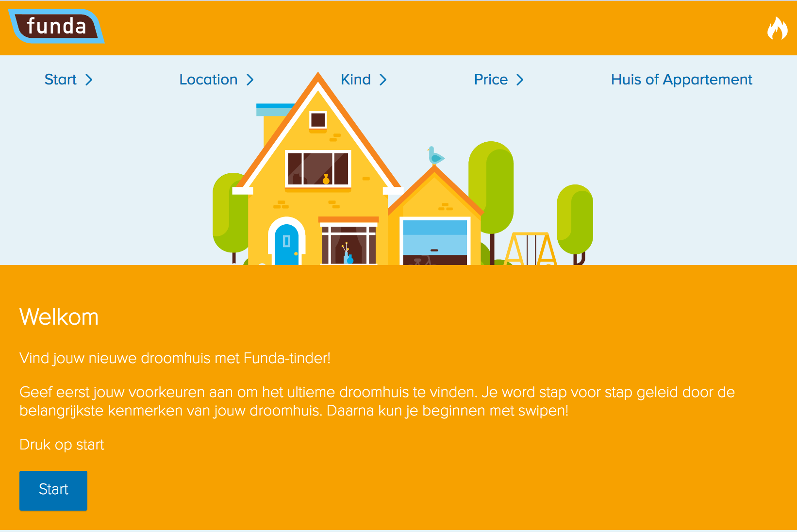
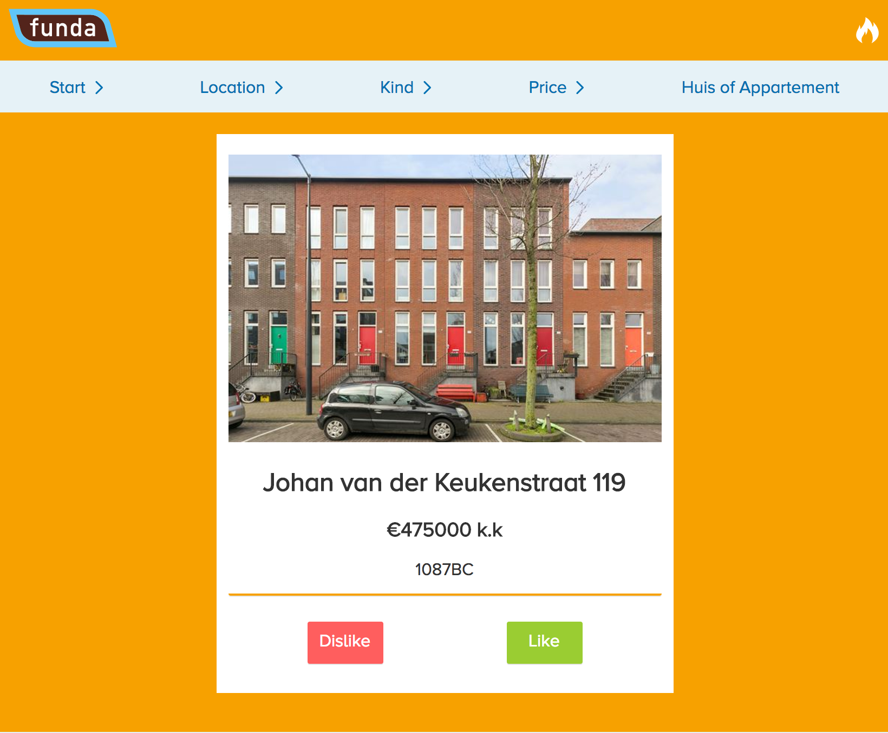
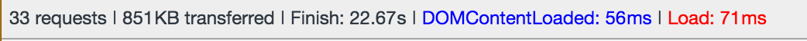

# Opdracht 1.2 Fork je Funda

Hieronder staat een lijst met mogelijke verbeteringen kwa performance en accesibility.
Gedacht vanuit de Progressive Enhancement strategie.



## Verbeteringen

In het vak Browser Technologies moeten we na denken over Progressive

*Bevindingen:*

- Door blokerende Javascript wordt er een hele tijd niet getoond.

- De afbeeldingen zijn nogal zwaar. Ook als ze opgeslagen worden in favorieten.


### Afbeeldingen



- Alt-tags ontbreken

- Afbeeldingen zijn erg groot

- Zou goed zijn als Funda ook gebruik gaat maken van het Webp formaat.
Dan kan er gebruik gemaakt worden van het picture element, met srcset. Hierdoor
kan de optimale foto ingeladen worden.


### Javascript

- Zonder Javascript is de app helemaal niet toegankelijk. Ook wordt er geen feedback gegeven
aan de gebruiker. Dit komt blokkerende js. 

- Het serverside renderen van de content, hierdoor zijn we niet meer afhankelijk van de client en kan
de gebruiker altijd de content bereiken

- Ik maak gebruik van localStorage, dit word niet door elke browser ge-support.

Mogelijke oplossing (Thanks Timo):
```
if (typeof(Storage) !== "undefined") {
    // Code for localStorage/sessionStorage.
} else {
    // Fallback (can be object storage)
}
```

### Broadband internet


De eerste 'pagina' wordt erg snel geladen:


Op het moment als hij de huizen gaat ophalen (ajax call), maakt hij nogal veel requests
tegelijk en duurt het daarom ook best lang voordat de data binnen is.
Hij haalt nu 15 huizen op per keer dit zou er gewoon 1 kunnen zijn. Dus hier valt ook nog veel te winnen kwa performance.



 
### Kleur

### Mouste/Terackpad

- Een gedeelte van de focus styles ontbreken.


### Verbeter punten

1. Feedback naar de gebruiker (no-script)
2. Serverside renderen van de content
3. Focus styles verbeteren.
4. Asynchroon in laden van de javascript