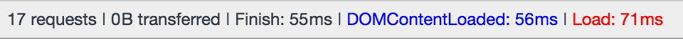

# Opdracht 1.2 Fork je Funda

Hieronder staat een lijst met mogelijke verbeteringen kwa performance en accesibility.
Gedacht vanuit de Progressive Enhancement strategie

## Table of contents
- [Verbeteringen](#verbeteringen)
- [1. Afbeeldingen](#afbeeldingen)
- [2. Javascript](#javascript)
- [3. Cookies](#cookies)
- [4. Broadband internet](#broadband)
- [5. Keyboard navigation](#keyboard)
- [6. Custom Fonts](#fonts)
- [7. Kleur](#kleur)
- [8. Mouse/Trackpad](#mouse)
- [Screen Reader](#screen)
- [Device lab](#device)
- [Verbeter punten](#verbeter)


## <a name="verbeteringen"></a> Verbeteringen

In het vak Browser Technologies moeten we na denken over Progressive

*Bevindingen:*

- Door blokerende Javascript wordt er een hele tijd niks getoond.

- De afbeeldingen zijn nogal zwaar. Ook als ze opgeslagen worden in favorieten (localStorage < ook een probleem op sommige browsers).

### <a name="afbeeldingen"></a> Afbeeldingen


- Alt-tags ontbreken

- Afbeeldingen zijn erg groot

- Zou goed zijn als Funda ook gebruik gaat maken van het Webp formaat.
Dan kan er gebruik gemaakt worden van het picture element, met srcset. Hierdoor
kan de optimale foto ingeladen worden.


### <a name="javascript"></a> Javascript

- Zonder Javascript is de app helemaal niet toegankelijk. Ook wordt er geen feedback gegeven
aan de gebruiker. Dit komt blokkerende js.

- Het serverside renderen van de content, hierdoor zijn we niet meer afhankelijk van de client en kan
de gebruiker altijd de content bereiken

- Ik maak gebruik van localStorage, dit word niet door elke browser ge-support.

Mogelijke oplossing (Thanks Timo):
```
if (typeof(Storage) !== "undefined") {
    // Code for localStorage/sessionStorage.
} else {
    // Fallback (can be object storage)
}
```

### <a name="cookies"></a> Coockies

Er wordt geen gebruik gemaakt van cookies in deze applicatie.

### <a name="keyboard"></a> Keyboard navigation

Veel states ontbreken. Deze moeten worden toegevoegd om de applicatie compleet door 'tabbaar' te maken.

### <a name="broadband"></a> Broadband internet

De eerste 'pagina' wordt erg snel geladen:



Op het moment als hij de huizen gaat ophalen (ajax call), maakt hij nogal veel requests
tegelijk en duurt het daarom ook best lang voordat de data binnen is.
Hij haalt nu 15 huizen op per keer dit zou er gewoon 1 kunnen zijn. Dus hier valt ook nog veel te winnen kwa performance.


### <a name="fonts"></a> Custom Fonts

- Er wordt geen gebruik gemaakt van icon-fonts
- "To combat the FOIT (Flash Of Invisible Text) a Fontface Observer can be implemented to show a temporary fallback font.""

### <a name="kleur"></a> Kleur

Iets wat niet vaak gecheckt word door developers maar vooral ook visual designers, is dat mensen kleuren anders kunnen interpeteren (kleuren blindheid). Dit zelfde is het geval met computers, deze renderen kleuren allemaal anders. Daarom is het kiezen van de goeie kleuren erg belangrijk om dingen goed leesbaar te maken.

In dit geval zit er in de kleuren die er gebruikt worden genoeg contrast. Tools om dit te checken zijn:

- [Sim Daltonism](https://michelf.ca/projects/sim-daltonism/)

### <a name="mouse"></a> Mouse/Trackpad

Een gedeelte van de focus styles ontbreken, een gedeelte is er wel. Hierdoor is niet de hele app te gebruiken, maar wel voor een groot deel.

### <a name="screen"></a> Screen readers

Ik heb gebruik gemaakt van de ChromeVox extension van Chrome om mijn web pagina te laten voorlezen. Ik ben erachter gekomen dat er een heleboel mis gaat voor gebruikers met screen-readers.

- Omdat ik dingen hide met JavaScript gaat het uitlezen van de DOM niet zo goed. Al die elementen staan natuurlijk nog in de DOM en worden daarom ook voorgelezen.


### <a name="device"></a> Device lab

De meeste devices van het Device lab gaan aardig goed om met mijn SPA. Alleen maak ik gebruik van localStorage en dit is niet op elk device gesupport. Waardoor de app dus niet optimaal gebruikt kan worden. (Niet alle filter opties kunnen ingevuld worden).


### <a name="verbeter"></a> Verbeter punten

1. Feedback naar de gebruiker (no-script)
2. Serverside renderen van de content
3. Focus styles verbeteren.
4. Asynchroon in laden van de javascript
