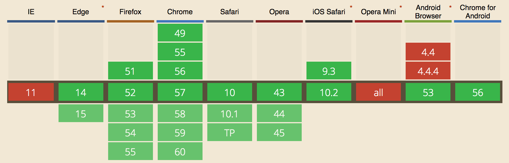
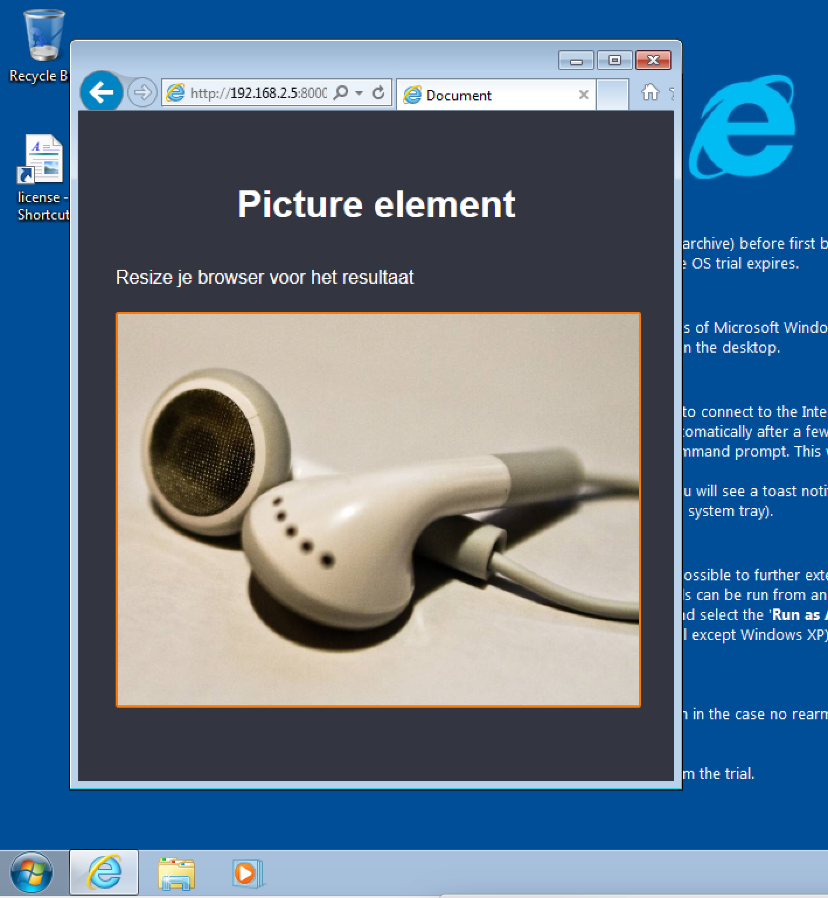
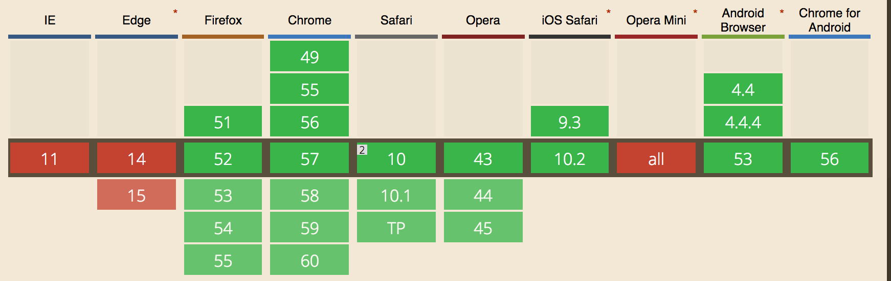
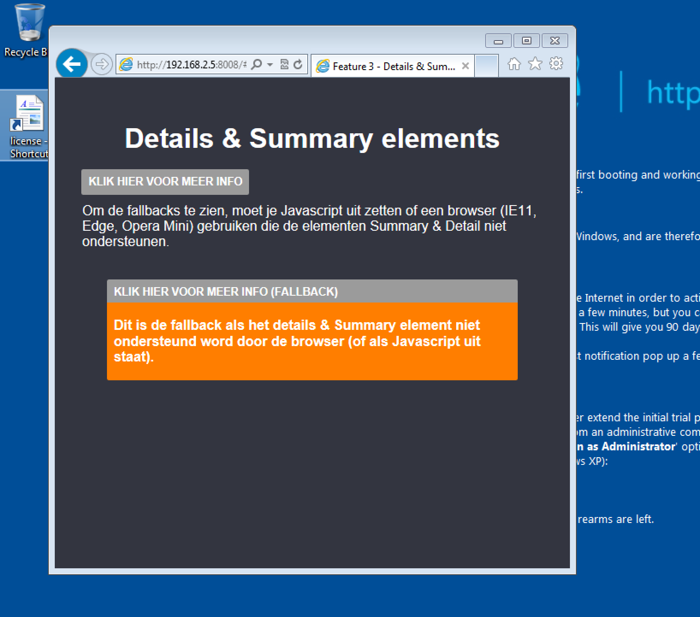
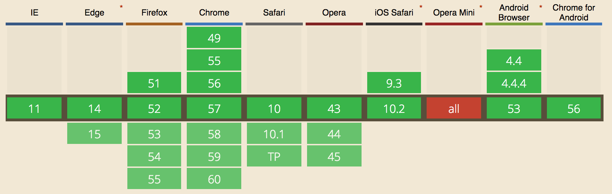
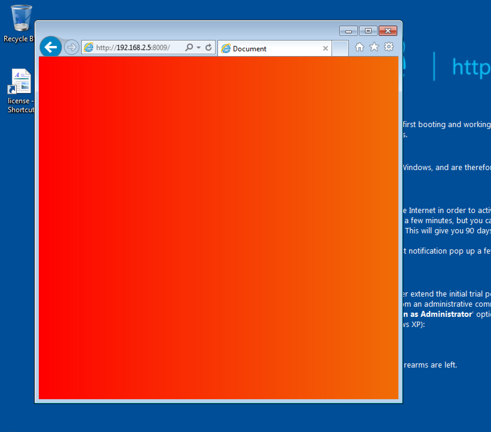
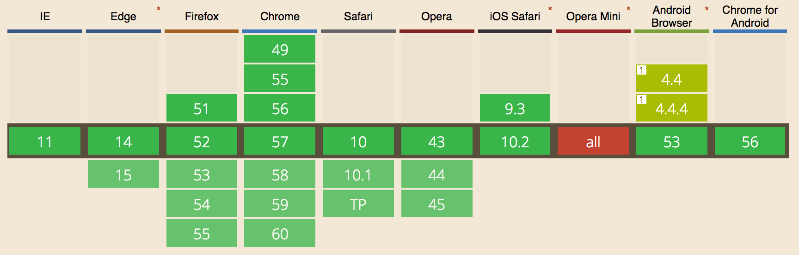
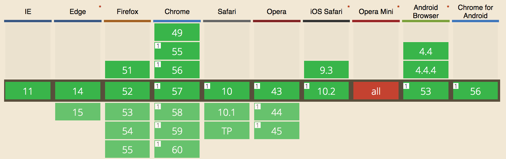

# Feature detection

## HTML5

### Feature 1 - Picture element

 

Het [Picture](https://developer.mozilla.org/en/docs/Web/HTML/Element/picture) element is een container die wordt gebruikt om
 meerdere `<source>` elementen te specificeren voor een specifieke ``.
 Het is een nieuw HTML element en wordt niet door alle browsers ondersteund.
 
 "A responsive images method to control which image resource a user agent presents to a user, based on resolution, media query and/or support for a particular image format"
 
 **Fallback:** Als de browser de picture tag support, dan wordt er 1 van de drie afbeeldingen in een van de `<source>` elementen getoond. Dit
 opbasis van dew grote van je scherm (hoge, medium en lage kwaliteit).
 
  
  
  Zoals hier boven te zien, word nu de standaard img getoond.

  
 
 ### Feature 2 - Details & Summary element
 
 
 
 Het [Details & Summary element]() word niet door alle browsers ondersteund. IE en Opera ondersteunen deze bijvoorbeeld
  niet.
  
  Daarom is het een goed element om een fallback voor te maken.
  
  **Fallback:** als het niet ondersteund is door de browser, of als de javascript uit staat. Word de standaard getoond. In dit geval
  is de JavaScript versie van het 'uitklap' element ge-hide (display: none). De fallback maakt gebruik van de
  CSS :target selector.
  
  Als het Details & Summary element ondersteund wordt, word wordt door middel van Javascirpt de standaard gehide. Vervolgens kan het element gewoon gebruikt worden.
  
  ```
  
    var details = document.getElementById('details');
   
       details.classList.remove('hidden');
   
       if (('open' in document.createElement('details'))) {
           document.getElementById('fallback').classList.add('hidden');
       }
       
```

Op IE9 word de fallback getoond:

 

 *Bronnen:*
  
  - http://html5doctor.com/the-details-and-summary-elements/
  - https://developer.mozilla.org/en-US/docs/Web/HTML/Element/details
 
 ## CSS
 
 ### Feature 3 - Gradients
 
  
 
 CSS [Gradients](https://css-tricks.com/css3-gradients/) worden door de meeste browsers wel ondersteund of gedeeltelijk ondersteund.
 Alleen opera mini support het helemaal niet. Hieronder is rekening gehouden met de verschillende browsers die dit niet, of gedeeltelijk
 ondersteunen.
 
 *Voorbeeld:*
 
 ```
 .gradient {
      
      /* Fallback (could use .jpg/.png alternatively) */
      background-color: red;
    
      /* SVG fallback for IE 9 (could be data URI, or could use filter) */
      background-image: url(fallback-gradient.svg); 
    
      /* Safari 4, Chrome 1-9, iOS 3.2-4.3, Android 2.1-3.0 */
      background-image:
        -webkit-gradient(linear, left top, right top, from(red), to(#f06d06));
      
      /* Safari 5.1, iOS 5.0-6.1, Chrome 10-25, Android 4.0-4.3 */
      background-image:
        -webkit-linear-gradient(left, red, #f06d06);
    
      /* Firefox 3.6 - 15 */
      background-image:
        -moz-linear-gradient(left, red, #f06d06);
    
      /* Opera 11.1 - 12 */
      background-image:
        -o-linear-gradient(left, red, #f06d06);
    
      /* Opera 15+, Chrome 25+, IE 10+, Firefox 16+, Safari 6.1+, iOS 7+, Android 4.4+ */
      background-image:
        linear-gradient(to right, red, #f06d06);
    
    }
    
```

Op IE9 word de fallback afbeelding (svg) getoond, zie hieronder:

 


### Feature 4 - Calc()

 
 
 The [Calc()](https://developer.mozilla.org/en/docs/Web/CSS/calc) CSS function can be used anywhere a:
 
 - `length`
 - `frequency`
 - `angle`
 - `time`
 - `integer`
 
 is required. With calc(), you can perform calculations to determine CSS property values.

*Voorbeeld:*

CSS:
```
.banner {
  position: absolute;
  left: 5%;                 /* fallback for browsers without support for calc() */
  left: calc(40px);
  width: 90%;               /* fallback for browsers without support for calc() */
  width: calc(100% - 80px);
  border: solid black 1px;
  box-shadow: 1px 2px;
  background-color: yellow;
  padding: 6px;
  text-align: center;
}
```
HTML:
```
<div class="banner">This is a banner!</div>
```

Voorbeeld op [Codepen](http://codepen.io/pierman1/pen/vxjQjv)

### Feature 7 - Feature Queries

Met [Feature Queries](https://hacks.mozilla.org/2016/08/using-feature-queries-in-css/) (`@support`) kan je 
als het ware testen of een feature gesupport word. Dit is een goeie manier voor het implementeren van 'fancy' interfaces,
vanuit de Progressive Enhancement gedachte.

De code in de query word alleen uitgevoerd, en geld aleen als de feature beschikbaar is:

```
@supports (display: grid) {
   // code that will only run if CSS Grid is supported by the browser 
   
   display: grid;
 }
```

**Bronnen:**

- https://hacks.mozilla.org/2016/08/using-feature-queries-in-css/


## JavaScript

### Feature 5 - Geo location

 

[Geolocation]() wordt niet door alle browsers ondersteund (	94.49% bijna allemaal).


Ik heb een fallback gemaakt die problemen voorkomt als de browser geoloatie niet ondersteund.

- Check of Geolocatie feature beschikbaar is
- Als hij beschikbaar is, word de longitude en de latitude ge-'print' op het scherm.
- Als hij **niet** beschikbaar is, word er ook een formulier getoond waar de gebruiker handmatig zijn locatie kan invullen.

Dus op het moment als de feature beschikbaar is, wordt de locatie automatisch neer gezet waar de gebruiker zich bevind.

Bronnen:

- https://gist.github.com/paulirish/366184


### Feature 6 - Google maps

Er word in eerste instantie een afbeelding getoond. Als JS beschikbaar is word deze vervangen door een afbeelding.

Dus de twee use cases zijn:

Met JavaScript:

- Er wordt een interactieve map getoond van de Google Maps API

Zonder JavaScript:

- Er wordt een afbeelding getoond, zodat de gebuiker altijd nog kan navigeren naar zijn bestemming


