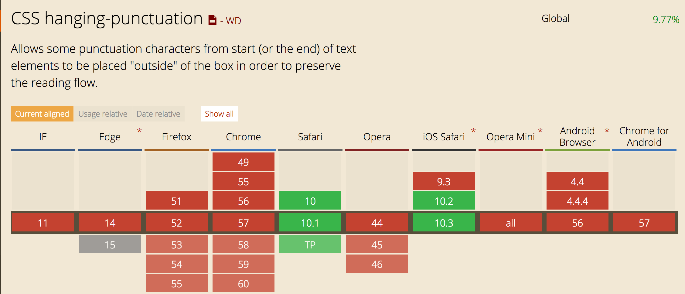
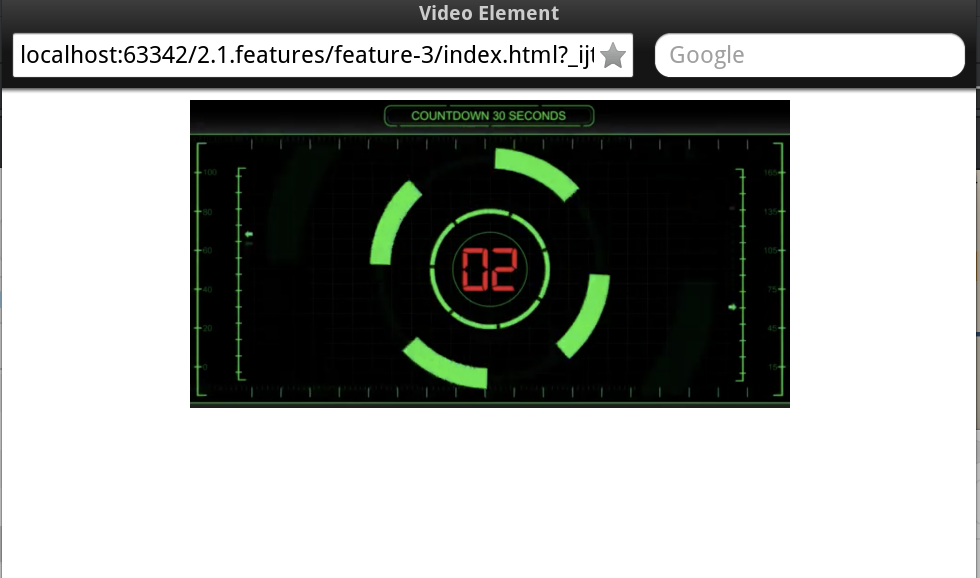
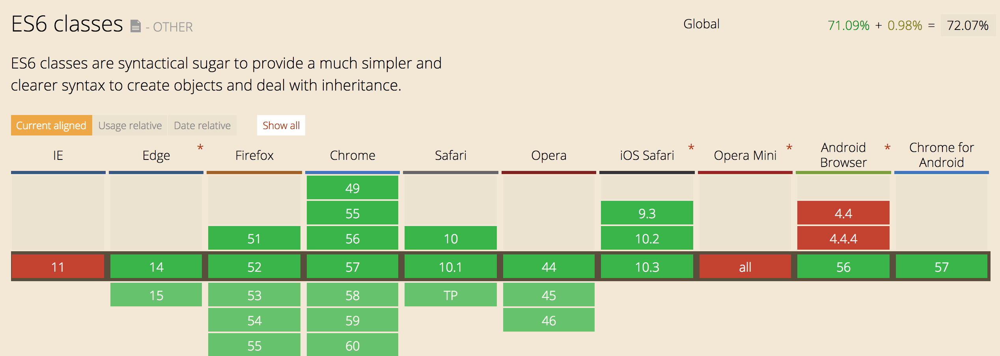

# Feature detection

## HTML5

### Feature 1 - CSS | Hanging-Punctuation

  
  
  CSS [Hanging-punctuation](https://css-tricks.com/almanac/properties/h/hanging-punctuation/)
  is bedoeld om web designers preciezere controle te geven over de typografie op het web.
  
  Met hanging punctuation zet je een letter(s) buiten hun text element, waardoor de de text meer doorloopt.
   
  Bijvoorbeeld de quote net een tikkie naar links verschuiven.
  
  Omdat dit door weinig browsers gesupport word (eigenlijk alleen op Safari) maak ik gebruik van een Feature
  Query om te checken of beschikbaar is.
  
  ```
  @support (hanging-punction) {
  
  }
  ```   
  
  Als de feature niet beschikbaar is krijgt de eerste letter van het ``<p>`` element een margin-left van -1em. Waardoor de eerste letter ``1rem`` naar link verschuift. 
  
  
### Feature 2 - CSS | Gradients
 
  
 
 CSS [Gradients](https://css-tricks.com/css3-gradients/) worden door de meeste browsers wel ondersteund of gedeeltelijk ondersteund.
 Alleen opera mini support het helemaal niet. Hieronder is rekening gehouden met de verschillende browsers die dit niet, of gedeeltelijk
 ondersteunen.
 
 *Voorbeeld:*
 
 ```
 .gradient {
      
      /* Fallback (could use .jpg/.png alternatively) */
      background-color: red;
    
      /* SVG fallback for IE 9 (could be data URI, or could use filter) */
      background-image: url(fallback-gradient.svg); 
    
      /* Safari 4, Chrome 1-9, iOS 3.2-4.3, Android 2.1-3.0 */
      background-image:
        -webkit-gradient(linear, left top, right top, from(red), to(#f06d06));
      
      /* Safari 5.1, iOS 5.0-6.1, Chrome 10-25, Android 4.0-4.3 */
      background-image:
        -webkit-linear-gradient(left, red, #f06d06);
    
      /* Firefox 3.6 - 15 */
      background-image:
        -moz-linear-gradient(left, red, #f06d06);
    
      /* Opera 11.1 - 12 */
      background-image:
        -o-linear-gradient(left, red, #f06d06);
    
      /* Opera 15+, Chrome 25+, IE 10+, Firefox 16+, Safari 6.1+, iOS 7+, Android 4.4+ */
      background-image:
        linear-gradient(to right, red, #f06d06);
    
    }
    
```

Op IE9 word de fallback afbeelding (svg) getoond, zie hieronder:

### Feature - 3 Video


Als het video element niet gesupport word dan word er een afbeelding getoond als fallback, dit is het geval in de browser: Opera Mini.



### Feature 4 - Audio

### Feature 5 - JS | ES6 



Bronnen:
- http://stackoverflow.com/questions/29046635/javascript-es6-cross-browser-detection
- http://stackoverflow.com/questions/29046635/javascript-es6-cross-browser-detection
- https://gist.github.com/bendc/d7f3dbc83d0f65ca0433caf90378cd95


### Feature 6 - JS | LocalStorage


[LocalStorage]() word best goed gesupport. Maar niet door Opera Mini. 
 
 Op het moment als LocalStorage niet beschikbaar is word de input van de gebruiker in een array opgeslagen.
 Dit zou een goeie fallback kunnen zijn voor een SPA. 
 


