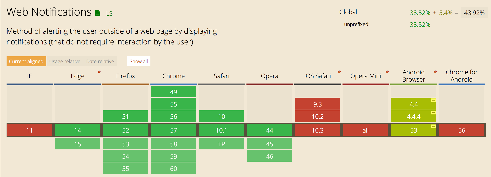

# Opdracht 3.1 - Progressive Enhanced Browser Technologies

**De opdracht:**

Maak een demo op basis van een use case. Zorg dat alle gbruikers, met alle browsers, in iedere context minimaal de core functionaliteit te zien/horen/voelen krijgen. Bouw je demo in 3 lagen volgens het principe van Progressive Enhancement. Gebruik als enhaced feature (hippe innovatieve, vooruitstrevende) Browser Technologie die je gaat onderzoeken op functionaliteit toegankelijkheid en (browser) ondersteuning.

## Mijn Use Case

> Ik wil een notificatie krijgen als mijn favoriete voetbalteam heeft gewonnen.

Hiervoor wil ik gebruik maken van [Web Notifications](https://notifications.spec.whatwg.org/). Dit wordt niet gesupport door alle browsers, dus daarom een goeie case om Progressive Enhancement op toe te passen. 



### Demo

In deze demo wordt de gebruiker op de hoogte gehouden van een voetbalwedstrijd.
Dit doormiddel van notificaties.

Als JS beschikbaar niet is:

	- Als dit niet het geval is wordt er door middel van een meta equiv een refresh gemaakt naar de 1.html, daar staat vervolgens de eerste score.
	- Vanuit deze gaat hij weer naar 2.html en so on.

Als JS wel beschikbaar is:

	- Er wordt met een ajax call om de 10 seconden data opgehaald uit de verschillende HTML bestanden. 
	- Als er een extra pagina wordt toegevoegd dan wordt deze score meegenomen in de JS versie. 

Als WebNotifications niet beschikbaar is:

    - De webnotificaties worden niet getoond, de gebruiker kan op de hoogte blijven door de interface te checken

#### HTTP-equiv

[HTTP-equiv](http://reference.sitepoint.com/html/meta/http-equiv)

	

Bronnen: 

- https://www.w3.org/TR/WCAG20-TECHS/H76.html
- https://developer.mozilla.org/en/docs/Web/API/notification

```
	<noscript>
		<meta id="next" http-equiv="refresh" content="5; URL=1.html" data-next="1.html">
	</noscript>
```


### Beoordelingscriteria

- De code staat in een repository op GitHub
- Er is een REadme toegevoegd met daarin beschreven:
	- een beschrijving van de *core functionality*
	- een beschrijving van de feature(s)/ Browser Technologies
	- welke browser de feature(s) wel/niet ondersteunen
	- een beschrijving van de accesibility issues die zijn onderzocht
- De demo is opgebouwd in 3 lagen, volgens het principe van Progressive Enhancement
- De user experience van de demo is goed
	- de leesbaarheidsregels zijn toegepast, contrast en kleuren kloppen
	- het heeft een gebruiksvriendelijke interface, met gebruik van affordance en feedback op de interactieve elementen
- Student kan uitleggen wat Progressive Enhancement en Feature Detectie is en hoe dit is toe te passen in Web Development.